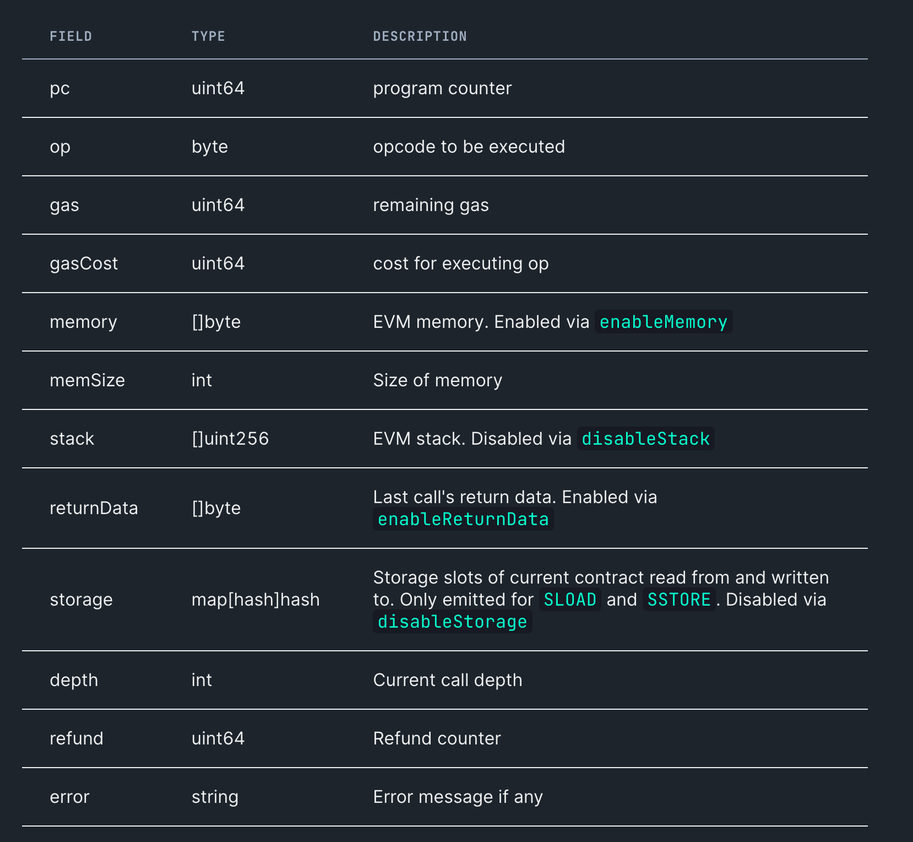

# geth trace

Trace 允许用户精确的检查 EVM 在执行一笔或一批交易时真实的执行情况: 做了什么操作, 产生了什么影响(状态改变, gas 消耗等)

## state 可用性

想获取历史某交易的 trace, 需要保证节点在该时刻的状态是可用的.

## trace types

geth 的  trace 是通过 tracer 来 emit 的, 不同的 tracer 可以返回不同格式的 trace, geth 内置了一些 tracer, 也支持自定义 tracer. 总体而言, geth 支持三种 trace:

* [Basic traces](https://geth.ethereum.org/docs/developers/evm-tracing#basic-traces): 最原始和底层的 EVM opcode traces, 也是默认的 trace
* Built-in tracers: geth 内置了一些 tracer（callTracer, 4byteTracer, etc）， 可以将 trace 的格式做一个转换处理, 返回更易读的 trace
* Custom tracers: geth 支持开发者根据需求自定义 tracer(本质是一个方法)，返回自身需要格式的 trace， 目前支持 go 和 js 两种语言开发

### [Basic traces](https://geth.ethereum.org/docs/developers/evm-tracing/basic-traces)

这是一种原始的 EVM opcode trace. 是由 geth 默认的 [Struct/opcode logger 产生的](https://geth.ethereum.org/docs/developers/evm-tracing/built-in-tracers#struct-opcode-logger). EVM 执行的每个指令, 都会产生一个结构化的 trace 或 log. 包含所有有用的上下文信息:



Opcode Trace 例子:

```json
{
  "gas": 25523,
  "failed": false,
  "returnValue": "",
  "structLogs": [
    {
        "pc": 48,
        "op": "DIV",
        "gasCost": 5,
        "gas": 64532,
        "depth": 1,
        "error": null,
        "stack": [
            "00000000000000000000000000000000000000000000000000000000ffffffff",
            "0000000100000000000000000000000000000000000000000000000000000000",
            "2df07fbaabbe40e3244445af30759352e348ec8bebd4dd75467a9f29ec55d98d"
        ],
        "memory": [
            "0000000000000000000000000000000000000000000000000000000000000000",
            "0000000000000000000000000000000000000000000000000000000000000000",
            "0000000000000000000000000000000000000000000000000000000000000060"
        ],
        "storage": {}
    }
  ]
}
```

[TraceConfig](https://geth.ethereum.org/docs/interacting-with-geth/rpc/ns-debug#traceconfig) 可用于控制 trace 的部分字段是否返回.

默认情况 memory 和 return data 不返回, stack 和 storage 默认返回, 但可以关闭.

```js
// 此配置可返回 geth 的所有数据
enableMemory: true
disableStack: false
disableStorage: false
enableReturnData: true
```

```js
debug.traceTransaction('0xfc9359e49278b7ba99f59edac0e3de49956e46e530a53c15aa71226b7aa92c6f', {
  enableMemory: true,
  disableStack: false,
  disableStorage: false,
  enableReturnData: true
});
```

返回结果参考: https://gist.github.com/karalabe/c91f95ac57f5e57f8b950ec65ecc697f

如果省略掉 memory, return data, stack, storage 返回的结果如下: https://gist.github.com/karalabe/d74a7cb33a70f2af75e7824fc772c5b4

### [内置高级 tracer](https://geth.ethereum.org/docs/developers/evm-tracing/built-in-tracers)

除了默认的 struct tracer, geth 还内置了一些 tracer, 可以将 struct tracer 的结果做一些转换, 以便更好的理解和分析. 部分是用 go 开发的, 性能更好, 部分是用 js 开发的, 更容易扩展.

通过 traceConfig.tracer 可以指定使用哪个 tracer, 默认是 struct tracer.

Go tracers:

* callTracer
* 4byteTracer
* prestateTracer

JS tracers:

* bigramTracer
* evmdisTracer
* opcountTracer
* trigramTracer
* unigramTracer

具体 tracer 介绍, 参看 geth 文档 https://geth.ethereum.org/docs/developers/evm-tracing/built-in-tracers

### 自定义 tracer

geth 支持使用 go 或 js 开发自定义的 tracer

## trace 相关的 RPC 方法

* [debug_traceTransaction](https://geth.ethereum.org/docs/interacting-with-geth/rpc/ns-debug#debugtracetransaction)
* [debug_traceBlock/debug_traceBlockByNumber/debug_traceBlockByHash](https://geth.ethereum.org/docs/interacting-with-geth/rpc/ns-debug#debugtraceblock)
* [debug_traceCall](https://geth.ethereum.org/docs/interacting-with-geth/rpc/ns-debug#debugtracecall)
  
[TraceConfig](https://geth.ethereum.org/docs/interacting-with-geth/rpc/ns-debug#traceconfig) 可用于控制 trace 的部分字段是否返回.

关于 RPC 的说明及参数介绍参看 geth 文档: https://geth.ethereum.org/docs/interacting-with-geth/rpc/ns-debug#debugtracetransaction

更多 trace 数据查看 [holesky-traces](./holesky-traces/README.md)

## 参考

* [evm.codes](https://www.evm.codes/)
* [geth debug RPC](https://geth.ethereum.org/docs/interacting-with-geth/rpc/ns-debug)
* [evm-tracing](https://geth.ethereum.org/docs/developers/evm-tracing)
* [trace 介绍视频](https://www.youtube.com/watch?v=b8RdmGsilfU)
* [geth tracer 相关代码](https://github.com/ethereum/go-ethereum/tree/master/eth/tracers)
* [geth StructLogger 代码](https://github.com/ethereum/go-ethereum/blob/master/eth/tracers/logger/logger.go#L108)